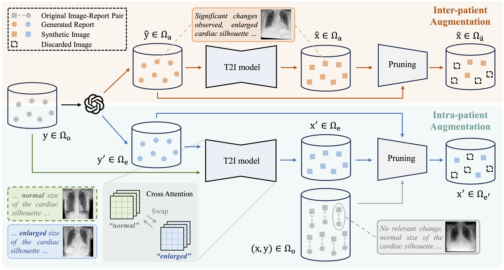

# PairAug

<p align="left">
    
</p>

This repo holds the Pytorch implementation of PairAug:<br />

**[CVPR2024] PairAug: What Can Augmented Image-Text Pairs Do for Radiology?** 


## Usage
* Create a new conda environment 
```
conda create --name pairaug python=3.10
source activate pairaug
```
* Clone this repo
```
git clone https://github.com/YtongXie/PairAug.git
cd PairAug
```
### Medical image-report pair generation
#### 0. Installation 
* Install packages for image generation
```
pip install -r requirements_T2I.txt
```
#### 1. Data Preparation
* Download [MIMIC-CXR-JPG dataset](https://physionet.org/content/mimic-cxr-jpg/2.1.0/) (Need to be a credentialed user for downloading) <br/>

* Put the image data under `data/MIMIC_images_ori/` should be like:
``` data/MIMIC_images_ori/
    ├── p19_p19995997_s50123635_6fa953ea-79c237a5-4ca3be78-e3ae6427-c327e17b.png
    ├── p19_p19996061_s58482960_87923de8-5595ad44-eaa89d38-610e97e2-42cacf04.png
    ├── p19_p19996762_s58960501_d1aa8bb2-afa746e5-7ff2d875-045be82e-9da2236e.png
    ├── p19_p19996786_s52281280_ff766df0-156bec0b-d33db351-26d340dd-4711ae6f.png
    ├── p19_p19997087_s56819576_d9eedfc8-38f766ac-309f0c5f-cea553c3-d06b9b23.png
    ├── p19_p19997293_s53859051_b7c6e487-b22d02c1-577476ea-07fa9244-9aed3945.png
    ├── ...
```
* Run `python data/reports_jsonl.py` to generate the report data lists `data/metadata_snets.jsonl`.
* Put the report data under `data/MIMIC_reports_ori/` should be like:
``` data/MIMIC_reports_ori/
    ├── p19_p19995997_s50123635_6fa953ea-79c237a5-4ca3be78-e3ae6427-c327e17b.txt
    ├── p19_p19996061_s58482960_87923de8-5595ad44-eaa89d38-610e97e2-42cacf04.txt
    ├── p19_p19996762_s58960501_d1aa8bb2-afa746e5-7ff2d875-045be82e-9da2236e.txt
    ├── p19_p19996786_s52281280_ff766df0-156bec0b-d33db351-26d340dd-4711ae6f.txt
    ├── p19_p19997087_s56819576_d9eedfc8-38f766ac-309f0c5f-cea553c3-d06b9b23.txt
    ├── p19_p19997293_s53859051_b7c6e487-b22d02c1-577476ea-07fa9244-9aed3945.txt
    ├── ...
```
#### 2. InterAug generation 
* Download pretrained RoentGen weights and put it under `pretrained/`. Need to contact authors of paper [RoentGen](https://arxiv.org/pdf/2211.12737.pdf) for download. 
* Run `python InterAug_Step1.py --start_index 0 --end_index 2200000` to generate new reports via ChatGPT, and save them in `data/InterAug/InterAug_reports`.
* Run `python InterAug_Step2_T2I.py --start_index 0 --end_index 2200000` to generate inter-patient images via RoentGen model, and save them in `data/InterAug/InterAug_images`.

#### 3. IntraAug generation 
* Run `python IntraAug_Step1.py --start_index 0 --end_index 2200000` to generate new reports via ChatGPT, and save them in `data/IntraAug/IntraAug_reports`.
* Run `python IntraAug_Step2_T2I.py --start_index 0 --end_index 2200000` to generate intra-patient images based on generated and original reports, and save them in `data/IntraAug/IntraAug_images`.

### Data Pruning
#### 0. Installation 
* Install packages for data pruning
```
pip install -r requirements_MedClip.txt
```
#### 1. Data Pruning for InterAug pairs
* Run
```
python InterAug_Step3_fliter.py
```
It introduces a data pruning method w.r.t. the semantic alignment between generated InterAug image-report pairs to ensure the quality of the generated pairs.
#### 2. Data Pruning for IntraAug pairs
* Run
```
python IntraAug_Step3_fliter.py
```
It introduces a hybrid consistency score between generated IntraAug image-report pairs to ensure the quality of the generated pairs.

### Acknowledgements
Thanks to [diffusers](https://github.com/huggingface/diffusers), [prompt-to-prompt](https://github.com/google/prompt-to-prompt/) and [RoentGen](https://arxiv.org/pdf/2211.12737.pdf) and for the latent diffusion model, prompt-to-prompt stable diffusion model and pretrained weights.

### Contact
Yutong Xie (yutong.xie678@gmail.com)
